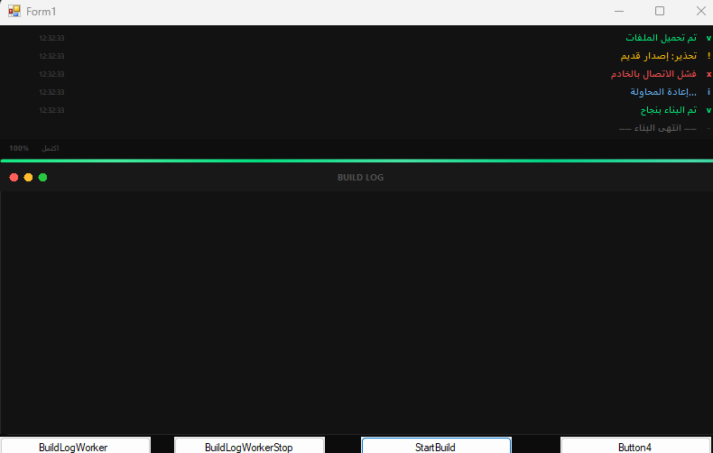

# 🚀 BuildLogControl – Advanced Build Log Control

**Version 5.0** | **Language: VB.NET** | **Platform: WinForms**

An **elegant**, **animated**, and **fully customizable** control for displaying build logs in your VB.NET WinForms applications. It features a queue‑based sequential appearance, a shimmering progress bar, RTL support, and a rich API for both synchronous and asynchronous logging.



---

## ✨ Key Features

- **🐢 Sequential Row Animation** – Messages appear one after another with a configurable delay (queue‑based animation).
- **🎨 Three Header Dots** – Independently show/hide the red, yellow, and green status dots.
- **📊 Animated Progress Bar** – Features a smooth **shimmer** effect and fluid value transitions.
- **⏱️ Built‑in Timer** – Tracks elapsed build time and displays it in the footer.
- **📝 Log Types** – Success, Error, Warning, Info, and Final, each with distinct colors.
- **🖼️ Custom Icons** – Assign your own images for success, error, and warning icons.
- **🎞️ Fade‑in Effect** – Gradual appearance of each row with adjustable duration.
- **🧹 Row Management** – Automatically removes oldest rows when exceeding the maximum limit.
- **🛠️ Helper & Worker Classes** – Simplify async build tasks with full cancellation support.
- **🎯 Full RTL Support** – Perfect for right‑to‑left languages (Arabic, Hebrew, etc.).
- **🎨 Extensive Color Customization** – Almost every visual element can be recolored.

---

## 📦 Requirements

- **.NET Framework 4.8** or higher (or .NET Core / .NET 5+ with WinForms support).
- **Visual Studio** (2019 or 2022) with the VB.NET workload installed.

---

## 🛠️ Installation & Usage

1. **Copy the `BuildLogControl.vb`** file into your project.
2. **Add the control to the Toolbox** by right‑clicking the Toolbox, selecting *Choose Items…*, and browsing to your project, or simply drag and drop the file into your solution.
3. **Drag `BuildLogControl`** from the Toolbox onto your form.
4. **Write your logging code** as demonstrated in the examples below.

---

## 🧪 Quick Examples

### 🔹 Basic Usage (Direct Logging)

```vb
' Add logs directly
BuildLogControl1.AddSuccessLog("Files loaded successfully")
BuildLogControl1.AddErrorLog("Server connection failed")
BuildLogControl1.AddWarningLog("Outdated library version")
BuildLogControl1.AddInfoLog("Compiling...")

' Control the build lifecycle
BuildLogControl1.StartBuild("Building...")
BuildLogControl1.SetProgress(50, "Compiling code")
BuildLogControl1.StopBuild(True)
